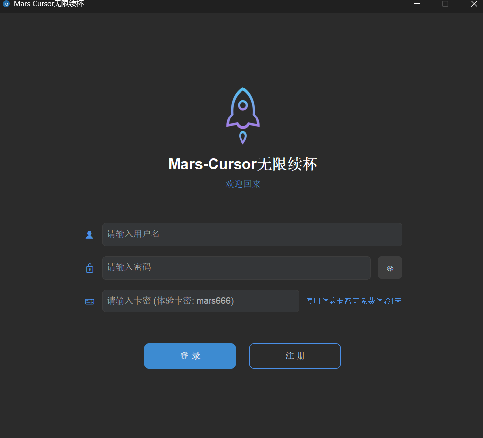
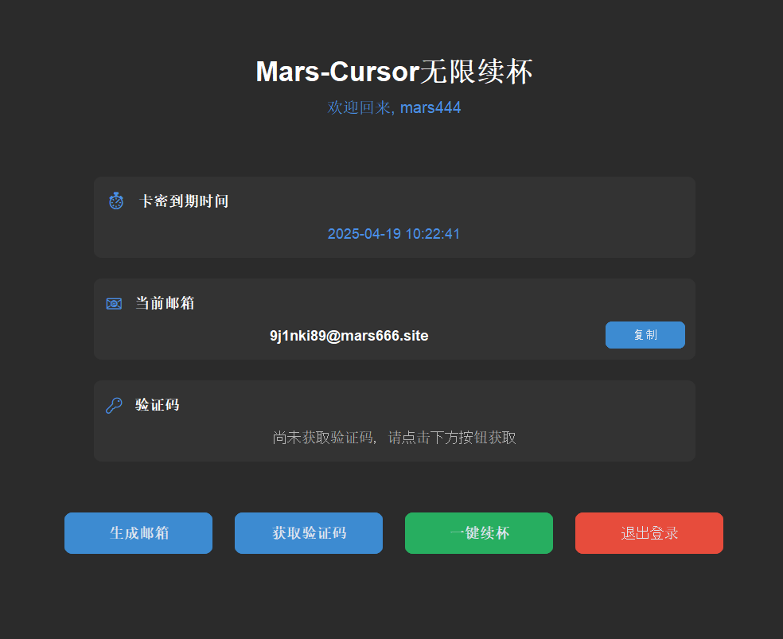
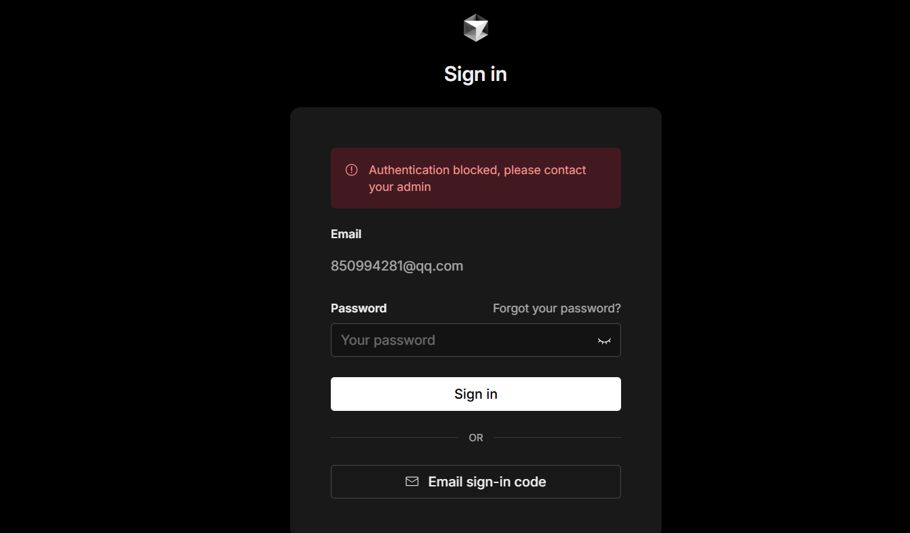
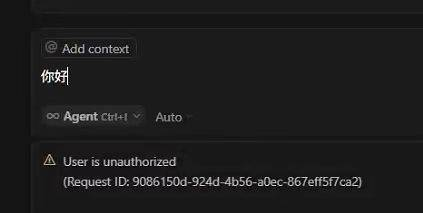

 # Mars-Cursor 无限续杯工具

Mars-Cursor 解决 Cursor 无限续杯、账号封禁等常见问题，同时提供丰富的接单资源，特别适合新手小白快速上手，轻松开启你的高效开发与副业变现之路！

## 问题现状：
cursor多次删除账号再登录后就会锁定账户，很多小伙伴找到我，说有没有新的办法解决这个，其实就是官方把我们账户封禁了，这个账户基本就不能使用了。
所以得换一种思路去解决这个问题，目前Mars自研这套是非常稳的，同时我也需要服务器成本，但是谁让你是咱们铁粉呢，必须让兄弟们极具性价比的使用Cursor（加入组织的徒弟或者学员开通永久使用权限一次付费后面的软件都白嫖
## 功能特点


- 🖱️ 支持无限邮箱验证码接收
- ⚡ 支持一键续杯
- 🎯 客服24小时在线指导
- 🔑 支持卡密验证系统
- 🎨 现代化用户界面
- 🔒 安全可靠的运行环境
- 💰 内置接单资源，轻松开启副业

## 能解决的问题




## 价格对比

| 功能 | Mars-Cursor   | 官网版本 |
|------|---------------|----------|
| 支持无限邮箱验证码接收 | ✅             | ✅ |
| 支持一键续杯 | ✅             | ✅ |
| 价格 | ￥299/永久       | $20/月 |
| 支持系统 | Windows/macOS | Windows/macOS |
| 技术支持 | 终身免费          | 仅订阅期内 |
| 更新服务 | 终身免费          | 仅订阅期内 |
| 接单资源 | ✅             | ❌ |
| 副业指导 | ✅             | ❌ |

> 💡 注：官网版本为订阅制，每月$20（140元），而 Mars-Cursor 为一个月39.9，还额外提供接单资源渠道。

## 系统要求

- Windows 10/11 或 macOS 10.13+
- Python 3.8 或更高版本

## 软件下载地址

- Windows:https://wwmq.lanzouu.com/ijlwV2twdiyj 密码:bb58
- macOS: 待上线

## 安装说明

### 方法一：直接使用可执行文件（推荐）

1. 下载最新版本的 `Mars-Cursor.exe`（Windows）或 `Mars-Cursor.app`（macOS）
2. 确保 `images` 文件夹与可执行文件在同一目录下
3. 管理员运行程序

### 方法二：从源代码运行

1. 克隆或下载本项目
2. 安装依赖：
   ```bash
   pip install -r requirements.txt
   ```
3. 运行主程序：
   ```bash
   python main.py
   ```

## 使用说明

1. 启动程序后，首先需要登录或注册账号
2. 使用体验卡密：`mars666` 可免费体验1天
3. 在主界面可以：
   - 生成邮箱
   - 一键续杯
   - 验证码接收


## 副业变现指南

1. 接单平台推荐：
   - 菜鸟编程导航 https://cainiao-coder.com/

2. 常见接单类型：
   - 网站开发
   - 小程序开发
   - 自动化脚本
   - 数据处理
   - 爬虫开发

3. 报价参考：
   - 基础网站：￥3000-10000
   - 小程序：￥1000-50000
   - 自动化脚本：￥1000-3000
   - 数据处理：￥500-2000/天
   - 爬虫开发：￥500-5000

4. 接单技巧：
   - 建立个人作品集
   - 保持良好沟通
   - 合理评估工期
   - 注意合同签订
   - 及时交付和验收

## 社群服务

欢迎加入【Mars-Cursor 技术交流群】！本群旨在帮助大家解决 Cursor 无限续杯、账户封禁、提供接单资源，尤其适合新手小白快速上手！

### 群二维码


### 远程协助服务
- 支持远程协助，使用 ToDesk 远程工具
- 提前下载好 ToDesk
- 付款后截图发送联系小助理获取卡密
- 安排远程操作，快速解决问题

### 联系方式和价格
- 小助理微信：Mars2181 或 Mars8333
- 博主微信：Mars8377
- 基础版：￥99（含接单资源群）
- 高级版：￥299（含接单资源群 + 永久上网工具）

### 注意事项
- 先付费后远程，诚信合作
- 人多请耐心等待，都会安排
- 支持远程协助，快速解决问题

### 限时福利
- 基础版（￥99）：
  - 赠送价值98元的接单资源群
- 高级版（￥299）：
  - 赠送价值98元的接单资源群
  - 赠送永久上网工具（梯子）

## 购买说明

1. 价格：
   - 基础版：￥99/三个月使用权
   - 高级版：￥299/一年使用权
2. 购买后获得：
   - 软件使用授权
   - 终身免费更新
   - 终身技术支持
   - 多设备使用权限
   - 接单资源包
   - 副业变现指导
   - 社群交流机会
3. 支付方式：
   - 支付宝
   - 微信支付

## 常见问题

1. 程序无法启动？
   - 确保已安装所有依赖
   - 检查 `images` 文件夹是否存在
   - 尝试以管理员身份运行

2. 收不到验证码？
   - 大概一分钟左右可以收到验证码

3. 卡密验证失败？
   - 确保输入的卡密正确
   - 检查网络连接是否正常
   - 确认卡密是否已被使用

4. 如何开始接单？
   - 注册各大接单平台账号
   - 完善个人资料和作品集
   - 从简单项目开始积累经验
   - 逐步提高报价和项目复杂度

## 联系方式

如有问题或建议，请联系：
- 邮箱：wqexpore@163.com
- 官网：www.marscursor.com
- 客服微信：Mars2181 或 Mars8333（小助理）
- 博主微信：Mars8377
- 接单交流群：添加客服微信获取入群方式

## 许可证

本项目采用 MIT 许可证。详见 [LICENSE](LICENSE) 文件。